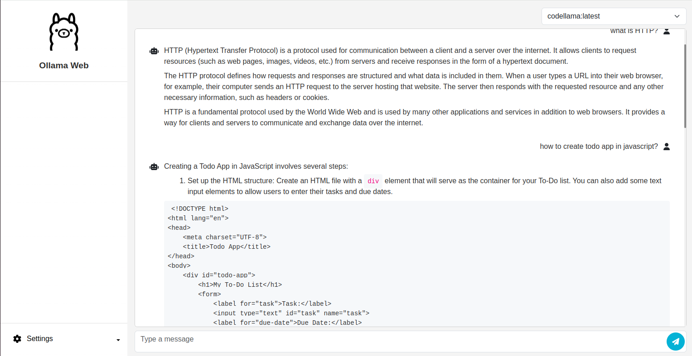

# Ollama Web UI

A Web UI for ollama api with RAG support, Built using Next.js and Django.

## Screenshots



## Run App in Local (Ollama Required)

### Using Docker

```bash
docker compose build
docker compose up
```
