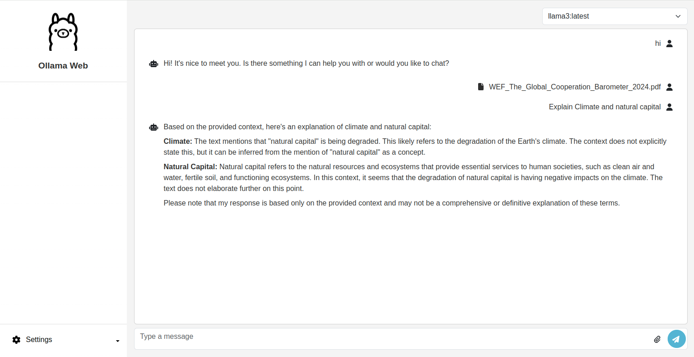

<a id="readme-top"></a>

<!-- PROJECT SHIELDS -->
<!--
*** I'm using markdown "reference style" links for readability.
*** Reference links are enclosed in brackets [ ] instead of parentheses ( ).
*** See the bottom of this document for the declaration of the reference variables
*** for contributors-url, forks-url, etc. This is an optional, concise syntax you may use.
*** https://www.markdownguide.org/basic-syntax/#reference-style-links
-->

<!-- [![Contributors][contributors-shield]][contributors-url]
[![Forks][forks-shield]][forks-url]
[![Stargazers][stars-shield]][stars-url]
[![Issues][issues-shield]][issues-url]
[![MIT License][license-shield]][license-url]
[![LinkedIn][linkedin-shield]][linkedin-url] -->

<!-- PROJECT LOGO -->
<br />
<div align="center">
  <a href="https://github.com/othneildrew/Best-README-Template">
    
  </a>

  <h3 align="center">Ollama RAG Web UI</h3>

  <p align="center">
    A web interface for Ollama with RAG support, built using Next.js and Django, and containerized with Docker.
    <br />
    <!-- <a href="https://github.com/othneildrew/Best-README-Template"><strong>Explore the docs »</strong></a> -->
    <!-- <br /> -->
    <br />
    <!-- <a href="https://github.com/othneildrew/Best-README-Template">View Demo</a>
    · -->
    <a href="https://github.com/guna81/ollama-rag-webui/issues/new?labels=bug&template=bug-report---.md">Report Bug</a>
    ·
    <a href="https://github.com/guna81/ollama-rag-webui/issues/new?labels=enhancement&template=feature-request---.md">Request Feature</a>
  </p>
</div>

<!-- TABLE OF CONTENTS -->
<details>
  <summary>Table of Contents</summary>
  <ol>
    <li>
      <a href="#about-the-project">About The Project</a>
      <ul>
        <li><a href="#built-with">Built With</a></li>
      </ul>
    </li>
    <li>
      <a href="#getting-started">Getting Started</a>
      <ul>
        <li><a href="#prerequisites">Prerequisites</a></li>
        <li><a href="#installation">Installation</a></li>
      </ul>
    </li>
    <li><a href="#usage">Usage</a></li>
    <!--<li><a href="#roadmap">Roadmap</a></li>-->
    <li><a href="#contributing">Contributing</a></li>
    <!-- <li><a href="#license">License</a></li> -->
    <li><a href="#contact">Contact</a></li>
    <li><a href="#acknowledgments">Acknowledgments</a></li>
  </ol>
</details>

<!-- ABOUT THE PROJECT -->

## About The Project



A LLM chat application that allows users to interact with open-source Large Language Models (LLMs) using Ollama APIs, enabling natural language conversations. Integrated retrieval-augmented generation (RAG) capabilities using LangChain, allowing users to ask questions and receive accurate answers directly from relevant documents.

### Built With

<!-- This section should list any major frameworks/libraries used to bootstrap your project. Leave any add-ons/plugins for the acknowledgements section. Here are a few examples. -->

- [![Next][Next.js]][Next-url]
- [![React][React.js]][React-url]
- [![Bootstrap][Bootstrap.com]][Bootstrap-url]
- [![Django][Django.com]][Django-url]

<!-- GETTING STARTED -->

## Getting Started

<!-- This is an example of how you may give instructions on setting up your project locally.
To get a local copy up and running follow these simple example steps. -->

### Prerequisites

Before you begin, ensure you have the following installed on your machine

- [Docker](https://docs.docker.com/engine/install/)
- [Docker Compose](https://docs.docker.com/compose/install/)

### Installation

1. Clone the repo

   ```sh
   git clone https://github.com/guna81/ollama-rag-webui.git
   cd ollama-rag-webui
   ```

2. Build and run the Docker containers
   ```sh
    docker-compose up --build
   ```

<!-- USAGE EXAMPLES -->

## Usage

The application should now be running and accessible at:

- Frontend: http://localhost:3000
- Backend: http://localhost:8000

<!--_For more examples, please refer to the [Documentation](https://example.com)_-->

<!-- ROADMAP -->

<!--## Roadmap-->

<!--- [x] Add Changelog-->
<!--- [x] Add back to top links-->
<!--- [ ] Add Additional Templates w/ Examples-->
<!--- [ ] Add "components" document to easily copy & paste sections of the readme-->
<!--- [ ] Multi-language Support-->
<!--  - [ ] Chinese-->
<!--  - [ ] Spanish-->

<!--See the [open issues](https://github.com/othneildrew/Best-README-Template/issues) for a full list of proposed features (and known issues).-->

<!-- CONTRIBUTING -->

## Contributing

Contributions are welcome! Please fork this repository and submit a pull request for any feature or bug fix.

<!-- ### Top contributors:

<a href="https://github.com/othneildrew/Best-README-Template/graphs/contributors">
  
</a> -->

<!-- LICENSE -->

<!-- ## License

Distributed under the MIT License. See `LICENSE.txt` for more information. -->

<!-- CONTACT -->

## Contact

Your Name - [https://twitter.com/guna81](https://twitter.com/your_username) - gunaps810@gmail.com

Project Link: [https://github.com/guna81/ollama-rag-webui](https://github.com/guna81/ollama-rag-webui)

<!-- ACKNOWLEDGMENTS -->

## Acknowledgments

- Devops Contributor - [Irwin Rex](https://github.com/irwinrex)
- Thanks to all contributors of the Ollama project.
- Special thanks to the maintainers of Next.js, Django, and Docker for their incredible tools.

<p align="right">(<a href="#readme-top">back to top</a>)</p>

<!-- MARKDOWN LINKS & IMAGES -->
<!-- https://www.markdownguide.org/basic-syntax/#reference-style-links -->

[contributors-shield]: https://img.shields.io/github/contributors/othneildrew/Best-README-Template.svg?style=for-the-badge
[contributors-url]: https://github.com/othneildrew/Best-README-Template/graphs/contributors
[forks-shield]: https://img.shields.io/github/forks/othneildrew/Best-README-Template.svg?style=for-the-badge
[forks-url]: https://github.com/othneildrew/Best-README-Template/network/members
[stars-shield]: https://img.shields.io/github/stars/othneildrew/Best-README-Template.svg?style=for-the-badge
[stars-url]: https://github.com/othneildrew/Best-README-Template/stargazers
[issues-shield]: https://img.shields.io/github/issues/othneildrew/Best-README-Template.svg?style=for-the-badge
[issues-url]: https://github.com/othneildrew/Best-README-Template/issues
[license-shield]: https://img.shields.io/github/license/othneildrew/Best-README-Template.svg?style=for-the-badge
[license-url]: https://github.com/othneildrew/Best-README-Template/blob/master/LICENSE.txt
[linkedin-shield]: https://img.shields.io/badge/-LinkedIn-black.svg?style=for-the-badge&logo=linkedin&colorB=555
[linkedin-url]: https://linkedin.com/in/othneildrew
[product-screenshot]: images/screenshot.png
[Next.js]: https://img.shields.io/badge/next.js-000000?style=for-the-badge&logo=nextdotjs&logoColor=white
[Next-url]: https://nextjs.org/
[React.js]: https://img.shields.io/badge/React-20232A?style=for-the-badge&logo=react&logoColor=61DAFB
[React-url]: https://reactjs.org/
[Vue.js]: https://img.shields.io/badge/Vue.js-35495E?style=for-the-badge&logo=vuedotjs&logoColor=4FC08D
[Vue-url]: https://vuejs.org/
[Angular.io]: https://img.shields.io/badge/Angular-DD0031?style=for-the-badge&logo=angular&logoColor=white
[Angular-url]: https://angular.io/
[Svelte.dev]: https://img.shields.io/badge/Svelte-4A4A55?style=for-the-badge&logo=svelte&logoColor=FF3E00
[Svelte-url]: https://svelte.dev/
[Laravel.com]: https://img.shields.io/badge/Laravel-FF2D20?style=for-the-badge&logo=laravel&logoColor=white
[Laravel-url]: https://laravel.com
[Bootstrap.com]: https://img.shields.io/badge/Bootstrap-563D7C?style=for-the-badge&logo=bootstrap&logoColor=white
[Bootstrap-url]: https://getbootstrap.com
[JQuery.com]: https://img.shields.io/badge/jQuery-0769AD?style=for-the-badge&logo=jquery&logoColor=white
[JQuery-url]: https://jquery.com
[Django.com]: https://img.shields.io/badge/django-0769AD?style=for-the-badge&logo=django&logoColor=white
[Django-url]: https://www.djangoproject.com/
